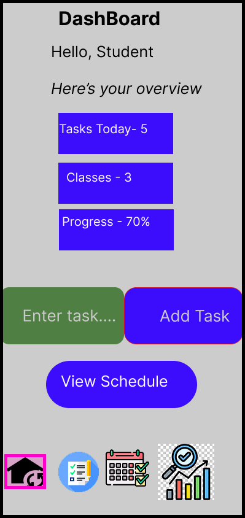
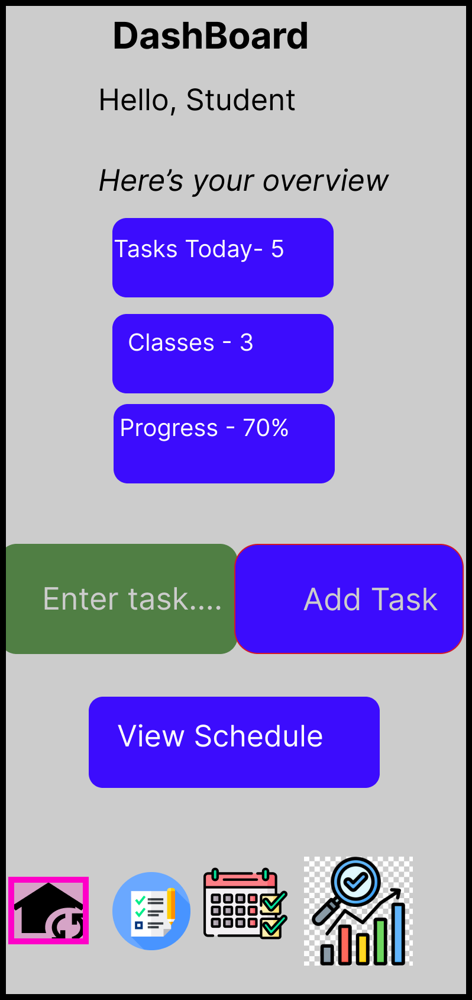
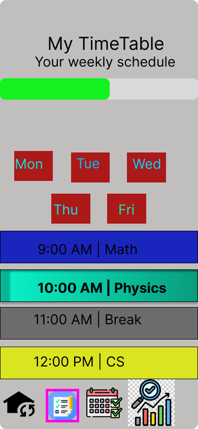
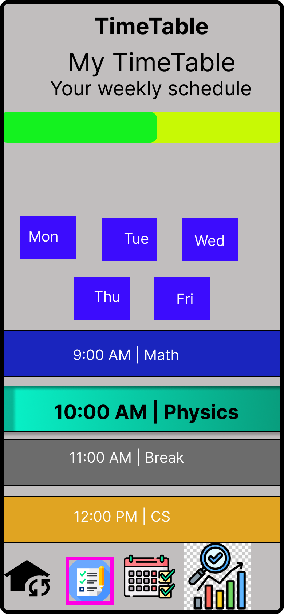

# Student Productivity App UI (Figma)

## Overview
A mobile app UI designed to help students manage tasks, schedules, and track progress.

## Features
- Login Screen
- Dashboard
- Task Manager
- Timetable
- Progress Tracking

## Tools Used
- Figma

## Prototype Link
https://www.figma.com/design/pG2CHrP8L8YRLh0hCFyEQH/Untitled?node-id=0-1&t=UFQm5IuJ9ZGeDK3R-1

## Screens

## Login Screen

## Dashboard

## TimeTable

## TaskList

## Progress Screen

